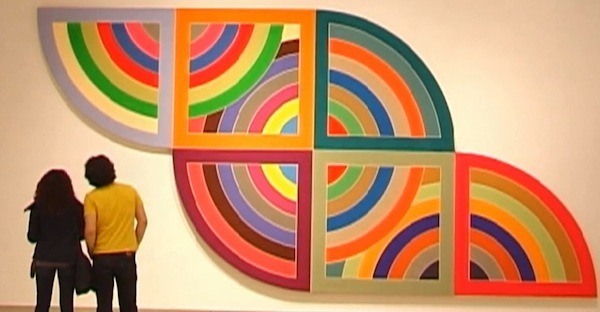
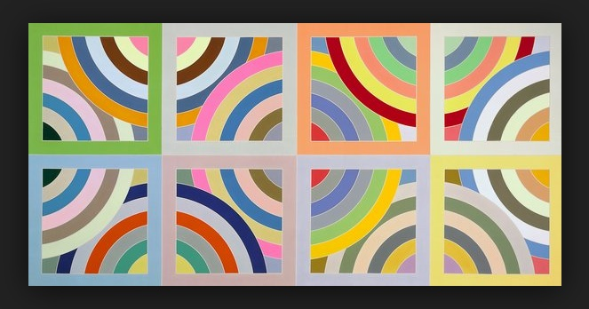

# yqiu0444_TUT5_Major-Project

## Instructions on how to interact with the work(Audio)

**Play/Pause Music：** Click the "Pause" button located at the top left corner to pause the music. Click again to resume the music.

**Observe the Animation：** Observe how the circles and patterns respond to the audio. The animation will keep changing as the music plays.

## Details of my individual approach to animating the group code

## （I choose to use *audio* to drive my individual code）

### Animated Properties

**1. Circle Sizes:**  The sizes of the concentric circles change based on the frequency spectrum of the audio. This makes the circles expand and contract in response to different frequencies.

**2. Shape Transformations:**  The shapes (circles, squares, and triangles) on the orange rings change based on the audio's frequency spectrum, providing a visually dynamic effect.

**3. Arc Movement:**  The pink arcs change their end angles based on the audio's frequency spectrum, creating a wave-like motion synchronized with the music.

These properties make my work unique as it focuses on audio-responsive animations（mainly shape and size changes）, contrasting with group members who might focus on color changes.

### References and Inspirations

### How did they influence my submission?

I feel the charm of geometric shapes and colors from this picture. Simple circles can be delicately arranged to create a dynamic visual effect, showing the aesthetics of abstract art. At the same time with the rich and vibrant color scheme, it gives the viewer a wonderful experience! So for my project I wanted to use bright colors and simple geometric shapes to create an ethnic visual effect, and I chose audio with an ethnic flavor!

### External Tools and Techniques

**1. p5.js Audio Library and p5.js Reference:**  Find and use the corresponding technique in the p5.js library.

Some functions taken from the p5.js library.

**‘new p5.FFT()’** 
   Purpose: Creates a Fast Fourier Transform (FFT) object for audio analysis.

**‘analyze()’** 
   Purpose: Analyzes the sound and returns an array representing the frequency spectrum.

**‘map(value, start1, stop1, start2, stop2)’** 
   Purpose: Re-maps a number from one range to another.

**‘arc(x, y, w, h, start, stop)’** 
   Purpose: Draws an arc.

**‘lerpColor(c1, c2, amt)’** 
   Purpose: Blends two colors to find a color between them.

**2. Techniques from the Internet:**  Learning by watching videos and applying what I learn.These links are the techniques I've utilized.

[Sound Visualization: radial graph](https://www.youtube.com/watch?v=h_aTgOl9J5I&list=PLRqwX-V7Uu6aFcVjlDAkkGIixw70s7jpW&index=10
Links to an external site.)

[Sound Visualization: Frequency Analysis with FFT](https://www.youtube.com/watch?v=2O3nm0Nvbi4&list=PLRqwX-V7Uu6aFcVjlDAkkGIixw70s7jpW&index=11
Links to an external site.)

[Code an Audio Visualizer in p5js](https://www.youtube.com/watch?v=uk96O7N1Yo0
Links to an external site.)

**With these functions, I can draw different shapes and sizes of graphics to match the audio features.:**

**1.Rotation of the Yellow Outer Ring:**
The rotation of the yellow outer ring is controlled by the **‘rotationAngle’**  variable, which is updated in the **‘draw’** method of the **‘Visualizer’** class. 

**2.Shape Changes of Squares and Triangles on the Yellow Outer Ring:** The shape changes of squares and triangles are handled by the **‘drawPatternOnRing’** function, which determines the shape type based on the **‘spectrum’** values.

**3.Changes of the Pink Arcs:** The changes in the pink arcs are controlled by the **‘drawArcThroughCenter’** function, which calculates the end angle based on the  **‘spectrumValue’**.

**4.Changes in the Size of the Concentric Circles:** The changes in the size of the concentric circles are controlled by the **‘draw’** method of the **‘CirclePattern’** class, which scales the radii based on the  **‘spectrumValue’**.

The changes in the size of the concentric circles are controlled by the draw method of the CirclePattern class, which scales the radii based on the spectrumValue.

*To watch the animation, please click the button in the upper left corner*

